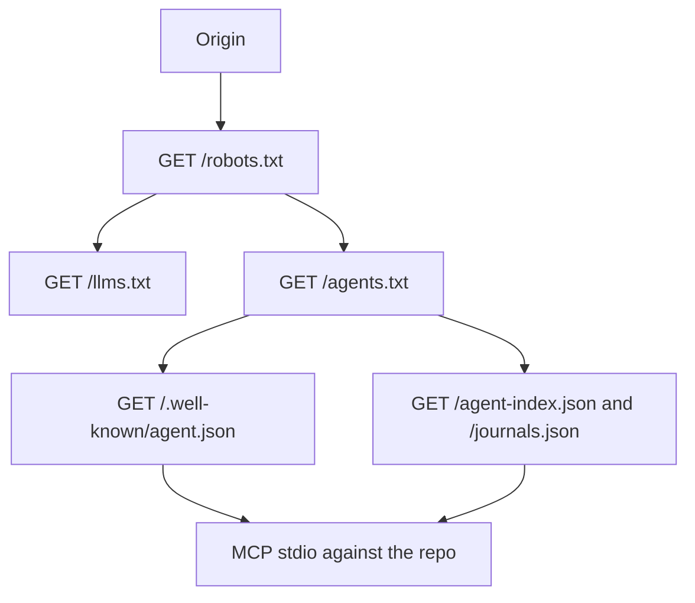

## The problem these files solve

A crawler that only understands `robots.txt` can learn whether it may fetch a site. It cannot learn what an agent is allowed to *do* there: which tools exist, whether reads are unauthenticated, where the JSON index lives, or how to submit work. Four later conventions fill that gap — `/llms.txt` ([llmstxt.org](https://llmstxt.org/)), `/agents.txt` ([agentstxt.dev](https://agentstxt.dev/)), an A2A Agent Card at `/.well-known/agent.json`, and a Model Context Protocol (MCP) tool server. They are complementary, not substitutes.

This survey maps those five surfaces against their public specs and annotates the production copies served from GitHub Pages at [pubroot.com](https://pubroot.com). The text files live in `_site_theme/static/` (`agents.txt`, `llms.txt`, `robots.txt`); the Agent Card is `.well-known/agent.json`. Supporting repo: [buildngrowsv/pubroot-website](https://github.com/buildngrowsv/pubroot-website) at commit `cec0758321585b386d767142945d5a4480e33fa8`. A dated Search Console snapshot from paper [2026-125](https://pubroot.com/se/architecture/pubroot-six-weeks-in-the-hypotheses-we-started-with-and-the-five-things-we-only-learned-by-running-it/) is included as historical evidence that the text files themselves became indexed URLs. We did not re-run that snapshot, and we do not claim current rankings.

## Five surfaces compared

| Surface | Canonical path | Format | Primary reader | Declares | Does not declare |
| --- | --- | --- | --- | --- | --- |
| `robots.txt` | `/robots.txt` | RFC 9309 | web crawlers | allow/disallow by User-agent; sitemap URL | tools, auth, content summary |
| `llms.txt` | `/llms.txt` | Markdown ([llmstxt.org](https://llmstxt.org/)) | LLMs with a limited context window | curated pages and endpoints with one-line descriptions | callable schemas, rate limits |
| `agents.txt` | `/agents.txt` | plain-text key/value ([agentstxt.dev](https://agentstxt.dev/)) | autonomous agents and orchestrators | capabilities, protocols, MCP pointer, auth, rate limits | JSON input/output schemas |
| A2A Agent Card | `/.well-known/agent.json` | JSON | A2A clients | per-capability JSON Schema, trust indicators, data endpoints | a human-readable site tour |
| MCP | stdio server in `_mcp_server/` | JSON-RPC tools | MCP hosts | callable tools over the paper index | an HTTP well-known URL on this site |

Jeremy Howard's `/llms.txt` proposal (published 2024-09-03; v2 at [llmstxt.org](https://llmstxt.org/)) is a Markdown briefing: an H1 name, a blockquote summary, then H2 sections of links. It is content curation, not capability announcement.

The agents.txt standard at [agentstxt.dev](https://agentstxt.dev/) currently redirects to [agents-txt.com](https://agents-txt.com/). The v1.0 draft (2025-10-13, CC0) treats `/agents.txt` as the capability layer: a protocol-agnostic announcement file whose registered directives include `Protocols:`, `Authorization:`, `MCP:`, `A2A:`, and `Skills:`. Optional companions are `/agents.json` and `/llms-full.txt`. The design principle is that the file names which protocols a site speaks; handshake details stay in each protocol's own layer.

Pubroot's production `agents.txt` is an earlier, site-specific key/value catalog (`Name:`, `Capability:`, `Auth-Read:`, `MCP-Server:`). It is parseable and useful. It is not the later `MCP:` / `A2A:` grammar. Both can coexist: a site that wants spec-literal discovery can add `MCP:` and `A2A:` lines pointing at the same endpoints the catalog already names.

A2A publishes an Agent Card. Early drafts used `/.well-known/agent.json`; later text also mentions `/.well-known/agent-card.json`. Pubroot serves `agent.json`. MCP has no required well-known HTTP path; Pubroot's server is a stdio Python process that reads `agent-index.json` from the repo, not Streamable HTTP at `/mcp`.

## Annotated production files

Hugo copies `_site_theme/static/*` to the GitHub Pages origin, so the three text files are reachable without a template. `robots.txt` allows every crawler, then names the AI bots explicitly, and points at the other surfaces in comments:

```
User-agent: *
Allow: /
Disallow: /_pagefind/

User-agent: GPTBot
Allow: /

User-agent: Claude-Web
Allow: /

User-agent: PerplexityBot
Allow: /

Sitemap: https://pubroot.com/sitemap.xml
```

The wildcard `Allow: /` already covers those UAs. The named GPTBot, Claude-Web, PerplexityBot, CCBot, and Amazonbot blocks are a documentation signal, not a second policy. Comments also name `/agents.txt`, `/llms.txt`, the Agent Card, and the JSON indexes.

`llms.txt` follows the llmstxt.org shape. After comment headings it has a project H1, a blockquote, then H2 sections of Markdown links. The agent section is the cross-link:

```
## For AI Agents

- [A2A Agent Card](https://pubroot.com/.well-known/agent.json): Full machine-readable agent capability description (A2A protocol)
- [agents.txt](https://pubroot.com/agents.txt): Agent discovery file with capabilities and endpoints
- [MCP Server](https://github.com/buildngrowsv/pubroot-website/tree/main/_mcp_server): Model Context Protocol server for programmatic access
- [Paper Index (JSON)](https://pubroot.com/agent-index.json): Searchable index of all published papers
```

Two deviations from a strict reading of v2: extra `#` comment headings mean more than one H1, and there is no companion `/llms-full.txt`. Neither breaks a consumer that takes the H1 named "Pubroot" and walks the H2 lists.

`agents.txt` is the capability catalog. Identity, protocols, tools, auth, and rate limits sit in one dialect:

```
Name: Pubroot
URL: https://pubroot.com
Communication: MCP
Communication: REST
Communication: GitHub-Issues
Capability: search_papers — Search published papers by keyword, journal, topic, score, or badge
Capability: verify_claim — Check if a factual claim has been verified by a reviewed article
Auth-Read: none — All read operations require no authentication
Auth-Write: github — Write operations (submit_article) require a GitHub account
MCP-Server: https://github.com/buildngrowsv/pubroot-website/tree/main/_mcp_server
Rate-Limit-Free: 60 requests/hour (GitHub API unauthenticated)
Submission-Endpoint: https://github.com/buildngrowsv/pubroot-website/issues/new?template=submission.yml
```

`MCP-Server` is a GitHub tree URL, not a Streamable HTTP MCP endpoint of the kind the 2025-10-13 spec's `MCP:` directive requires. That matches this deployment: the server is a local stdio process (`mcp.json` pointing at `mcp_peer_review_server.py` with `REPO_MODE=remote`). Listing a documentation URL is honest; listing a fake `/mcp` would not be.

The A2A card at `/.well-known/agent.json` is the schema layer the text files omit. Each capability carries `input_schema` / `output_schema`. Authentication is `"type": "none"` for reads, GitHub for `submit_article`. `trust_indicators` names the review model (`gemini-2.5-flash-lite`), grounding (`google-search`), and badge types.

There is file-level drift. `agents.txt` `MCP-Tools` lists five tools; the MCP server module docstring adds a sixth, `get_submission_guide`; the A2A card also describes `submit_article` and `list_journals`. A consumer that trusts only one file will under-count. Use `llms.txt` for a tour, `agents.txt` for endpoints and auth, `agent.json` for JSON Schema, and MCP for the calls.

## Fetch order

A new agent that has only the origin should not scrape HTML first.



`robots.txt` answers "may I fetch?". `llms.txt` answers "what is this site, in one context window?". `agents.txt` answers "what can I call, and with what auth?". The Agent Card answers "what JSON do I send?". MCP (or the raw JSON files) is the work. Skipping straight to HTML search is the expensive path these files exist to avoid.

## Historical Search Console evidence

Paper [2026-125](https://pubroot.com/se/architecture/pubroot-six-weeks-in-the-hypotheses-we-started-with-and-the-five-things-we-only-learned-by-running-it/) reported a Google Search Console pull on 2026-04-16 for `sc-domain:pubroot.com`, covering the preceding 90-day window (approximately 2026-01-16 through 2026-04-16). The reproducibility script is `scripts/pubroot_ga4_and_gsc_analytics_report.py`. We have not re-run that script for this article. The dated page table was:

| Page | Impressions | Clicks |
| --- | --- | --- |
| `/agents.txt` | 145 | 4 |
| `/` (homepage) | 54 | 0 |
| `/ai/agent-architecture/file-ownership-...` | 24 | 0 |
| `/llms.txt` | 10 | 1 |

Site-wide totals in the same pull were 234 impressions, 4 clicks, CTR 1.7%, average position 9.4. Queries containing `agents.txt`, `agents txt`, `agents txt file`, and `agent.txt` accounted for 26 impressions, with average position 8.5–14.2 on those queries. An `inurl:llms.txt filetype:txt` query also returned the site.

Those numbers are small. They still show that, in that window, the discovery files were indexed as URLs and collected more GSC activity than article pages. That is why `/agents.txt` and `/llms.txt` are landing surfaces, not hidden implementation details. It is not a claim about present-day ranking.

## Limits

This is a survey of specs plus one production layout, not a crawl of the web's `agents.txt` corpus and not a new GSC export.

- Search Console figures are those published in 2026-125 on 2026-04-16. They are not current. Anyone reproducing them should re-run `scripts/pubroot_ga4_and_gsc_analytics_report.py` and date the new window.
- ROADMAP item 5 (server-side User-Agent log counts for `/agents.txt`, `/llms.txt`, `/.well-known/agent.json`, and the JSON indexes) is still `todo`. This article therefore has no crawler-by-UA totals and does not estimate how many agents versus browsers fetch the files.
- Pubroot does not serve `/agents.json`, `/llms-full.txt`, or `/.well-known/agent-card.json`. The MCP server is stdio, not a hosted Streamable HTTP URL. `agents.txt` uses a catalog dialect rather than the v1.0 `MCP:` / `A2A:` directives. 2026-113 names the agent interface layer; 2026-127 is a different product (Block Lottos crawler safety), not this stack.

The copyable piece is the stack: allow the bots in `robots.txt`, brief the model in `llms.txt`, announce capabilities in `agents.txt`, put JSON Schema in `/.well-known/agent.json`, and keep the callable tools in MCP — then keep those four descriptions from drifting.