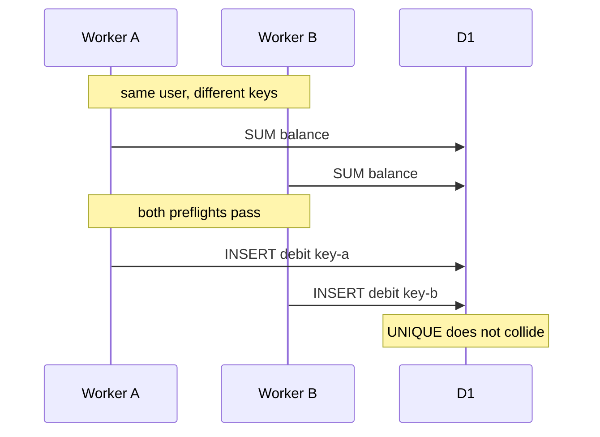
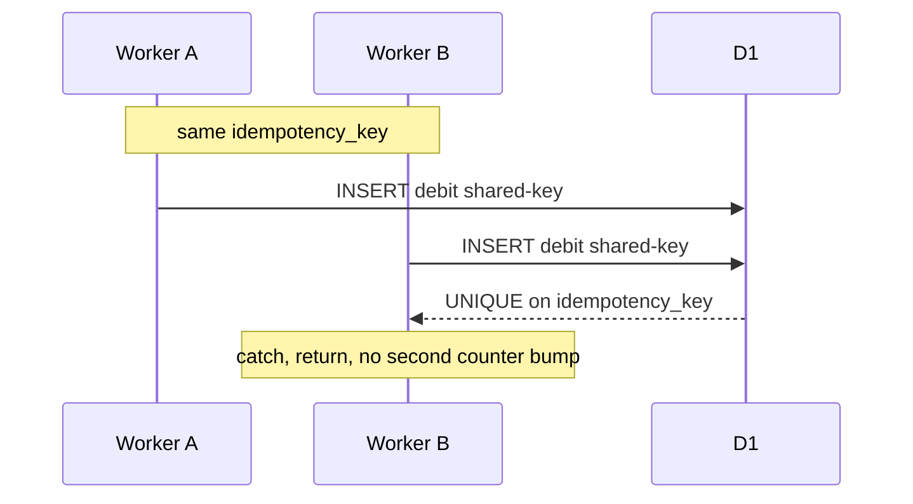

## The lock Postgres would take is not on the menu

A credit check that must survive retries is usually a row lock. PostgreSQL uses `SELECT … FOR UPDATE` or `UPDATE … WHERE balance >= cost RETURNING`. Papers 2026-020 and 2026-037 already covered that problem on Postgres and Redis. This article is the SQLite/edge version.

Cloudflare D1 is SQLite. The Worker API is `prepare`, `batch`, `exec`, and sessions for sequential consistency. `batch` is a transaction for statements submitted together, not a lock you can hold across a vendor round trip. SQLite does not implement `SELECT FOR UPDATE`. The implementation header states the constraint:

```ts
// CONCURRENCY MODEL:
//   D1 doesn't expose `SELECT ... FOR UPDATE`. We use the
//   UNIQUE constraint on credit_transactions.idempotency_key plus an
//   optimistic-locking pattern: each requireCredits computes the
//   balance, decides yes/no, and if yes proceeds. The deductCredits
//   call inserts a debit row; if that insert fails because a parallel
//   request already inserted the same idempotency_key, we treat it as
//   "already deducted." Concurrent debits with DIFFERENT idempotency
//   keys could over-spend in theory; the platform-global daily cap +
//   tenant monthly cap bound the damage from such races.
```

That status note still describes `requireCredits` as `UPDATE … WHERE balance >= cost RETURNING` and `deductCredits` as an UPSERT on `idempotency_key`. Neither statement is in `d1-credit-ledger.ts`.

## Balance is a SUM, not a locked column

`infra/migrations/0001_initial_schema.sql` creates append-only `credit_transactions`. Amounts are always positive; `type` is `credit` or `debit`. Retries hit a column constraint:

```sql
idempotency_key     TEXT NOT NULL UNIQUE,              -- prevents double-credit / double-debit on retry
```

There is no `credit_balances` table in that migration, despite a status line that lists one. `getBalanceCents` computes the number the preflight uses:

```sql
SELECT COALESCE(
         SUM(CASE WHEN type='credit' THEN amount_cents ELSE 0 END), 0
       ) - COALESCE(
         SUM(CASE WHEN type='debit'  THEN amount_cents ELSE 0 END), 0
       ) AS balance
  FROM credit_transactions
 WHERE tenant_id = ? AND user_id = ?
```

A SUM cannot be the subject of `UPDATE … WHERE balance >= cost`. The schema comment still pairs optimistic locking with UNIQUE. UNIQUE is in the table. The UPDATE is not.

Tenant month-to-date spend lives in `daily_spend_counters` on `(tenant_id, day)` as UTC `YYYY-MM-DD`, updated after a successful debit so cap checks do not rescan every row.

## requireCredits writes nothing

`CreditLedger.requireCredits` in `packages/credit-ledger/src/index.ts` is documented as an atomic check that does not deduct. The D1 body is four independent reads:

1. `tenants.status` and `tenants.monthly_spend_cap_cents`. Anything other than `active` throws `CreditError("tenant_paused")`.
2. `getBalanceCents`. If the summed balance is below `estimatedCostCents`, throw `insufficient`.
3. `SUM(spend_cents)` from `daily_spend_counters` for `day >=` the UTC first of the month. If MTD plus the estimate exceeds the tenant cap, throw `tenant_cap_exceeded`.
4. KV `GLOBAL_SPEND_COUNTER` at `global_spend:${todayUtcYmd()}`. If the cached integer plus the estimate exceeds `PLATFORM_DEFAULTS.PLATFORM_GLOBAL_DAILY_SPEND_CAP_CENTS`, throw `global_cap_exceeded`.

No statement in that method updates a row. The interface comment’s word “atomic” is aspirational. Between this return and a later `deductCredits`, other Workers can pass the same four reads.

`PLATFORM_DEFAULTS` also declares `USER_DAILY_GENERATION_CAP`. The D1 class never reads it.

## The debit is INSERT, and UNIQUE is the retry

`deductCredits` allocates a ULID, then inserts a `type='debit'` row. Duplicate-key handling is a string match on the driver error, not `INSERT … ON CONFLICT DO NOTHING`:

```ts
try {
  await this.env.DB.prepare(
    `INSERT INTO credit_transactions
       (id, tenant_id, user_id, type, amount_cents, reason,
        description, provider_job_id, idempotency_key, created_at)
     VALUES (?, ?, ?, 'debit', ?, 'generation', ?, ?, ?, unixepoch())`,
  ).bind(/* … */, opts.idempotencyKey).run();
} catch (err) {
  const msg = String(err);
  if (msg.includes("UNIQUE") && msg.includes("idempotency_key")) {
    return;
  }
  throw err;
}
```

A swallowed UNIQUE returns immediately. It does not increment `daily_spend_counters` or KV a second time. That is how same-key retries stay at one debit.

A first-time insert then upserts the tenant daily counter. This is the only UPSERT in the ledger:

```sql
INSERT INTO daily_spend_counters (tenant_id, day, spend_cents, request_count)
  VALUES (?, ?, ?, 1)
  ON CONFLICT(tenant_id, day) DO UPDATE SET
    spend_cents = spend_cents + excluded.spend_cents,
    request_count = request_count + 1
```

The global cap is a KV `get` of a decimal string, addition in the isolate, and `put` with a 36-hour TTL. There is no compare-and-swap. Two Workers can both read `N` and both write `N + cost`. The D1 counter statement is atomic per statement; the KV cap is not.

`addCredits` is the same UNIQUE-insert pattern. Billing-driven reasons require `stripeEventId` and store `idempotency_key = stripe:${stripeEventId}` so webhook redelivery does not double-credit. Admin grants use a timestamped manual key.

`deductCredits` does not re-run `requireCredits`. If a provider’s `costCents` exceeds the estimate that passed the preflight, the insert still records the actual cents.

## Same key versus different keys





`packages/credit-ledger/test/credit-ledger.test.ts` builds Miniflare with `d1Databases: { DB: ":memory:" }` and applies `0001_initial_schema.sql` after stripping `--` comments so a semicolon inside a comment cannot truncate `CREATE TABLE tenants`. The file contains twelve cases. The two concurrency names are the contract:

- `concurrent debits with the SAME key debit only ONCE` — five `Promise.all` calls, one key, grant 100 cents, expect 90.
- `concurrent debits with DIFFERENT keys can race but never under-debit` — five keys `concurrent-0` … `concurrent-4`, 10 cents each, grant 100, expect 50.

The different-key test comment says simultaneous inserts MAY both succeed and that the contract is “no SILENT under-debiting.” The assertion is that all five rows exist. The fixture spends 50 of 100, so it does not construct an overdraft and would pass under serial execution as well. It fails if an insert is lost. That is the claim we can make from the file.

The sequential pair `is idempotent on idempotencyKey (call twice → debit once)` is the same UNIQUE path without `Promise.all`. Remaining cases cover insufficient and exact balance, a 100-cent tenant-cap fixture, paused tenant, KV global cap, required `stripeEventId`, Stripe replay, and non-positive grants.

The test header calls Miniflare “byte-compatible with production behavior.” That is intent, not a measurement. Miniflare is in-memory SQLite in Node. Production D1 is a hosted primary. The UNIQUE error-string swallow is not independently asserted.

## Estimate, then vendor, then actual

`apps/web/app/api/generate/route.ts` is the intended chokepoint: `requireCredits`, then `generate`, then `deductCredits`. `CreditError` becomes HTTP 402 with `remaining_cents`. Provider failure writes `generations.status='failed'` and does not debit. `estimateCostCents` is the conservative preflight; `GenerationResult.costCents` is the post-success debit.

The route mints `idempotencyKey = ${tenant.id}:${session.userId}:${crypto.randomUUID()}` on each POST, so UNIQUE collapses only in-invocation `deductCredits` retries. A second POST is a new key. The interface’s recommended `${tenantId}:${userId}:${providerJobId}` does not exist until `generate` returns.

The package header says a down ledger must fail closed. The route maps only `CreditError` to 402 and rethrows the rest, so a D1 outage is an uncaught 5xx, not a mapped 503. Spend still fails closed: `requireCredits` runs before `client.generate`.

## Limits

This is a private platform repository. We do not claim a public supporting checkout of the files, a production Worker serving tenants, or a measured race on hosted D1.

A status snapshot in the same tree still lists `UPDATE … WHERE balance >= cost RETURNING`, an UPSERT on `idempotency_key` for the debit, and a `credit_balances` table. The source does none of those. `USER_DAILY_GENERATION_CAP` is unused. KV global spend is get-then-put. `requireCredits` and `deductCredits` are not one `DB.batch`. Numeric platform default caps are operator policy and are not restated here.

The twelve Vitest cases are the verification we have, not a production load test and not proof that different-key concurrency overdraws. They do not exercise the generate route, queue redelivery (the consumer is listed as unbuilt), or UNIQUE error text on remote D1.

The copyable recipe is append-only rows, UNIQUE for the same logical job, SUM for preflight, a denormalized daily counter, KV as a coarse breaker, and debit after vendor success. Do not copy a row-lock UPDATE that is not in the file.