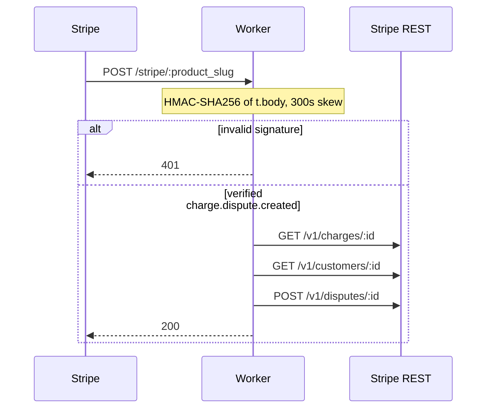

## Why a Worker, and why not stripe-node

Stripe card-network disputes arrive as HTTPS POSTs. The useful event is `charge.dispute.created`: the payload names a dispute and a charge, and the merchant then has a finite window to attach evidence via `POST /v1/disputes/:id`. Copying that handler into every app repository duplicates signature verification, evidence assembly, and the HTTP contract with Stripe.

The repository `stripe-dispute-worker` is one Cloudflare Worker, `src/index.js`. Its header comment states the choice: one Worker, many path suffixes, no per-product copies of dispute logic. `package.json` lists only `wrangler` as a devDependency. There is no `stripe` package. The verification comment omits stripe-node as too heavy for the Workers runtime and implements HMAC with `crypto.subtle`.

This is not a Checkout integration. Paper 2026-036 standardized native HTTPS `POST https://api.stripe.com/v1/checkout/sessions` on Vercel to avoid bundling the SDK for session creation. The Worker authenticates inbound webhooks with Web Crypto, then speaks the Disputes API with the same form-encoded `fetch` style.

`wrangler.toml` sets `main = "src/index.js"`, `compatibility_date = "2024-12-01"`, and `nodejs_compat`. HMAC uses the Workers Web Crypto API, not Node’s `crypto`. A KV binding for event idempotency is commented out, not wired.

## Reconstructing Stripe’s signed payload

Stripe documents `Stripe-Signature` as a comma-separated list of `t=<unix-seconds>` and one or more `v1=<hex>` HMAC-SHA256 digests. The signed string is not the JSON body alone; it is `timestamp + "." + rawBody` ([verify signatures manually](https://docs.stripe.com/webhooks#verify-manually)). Official libraries default the replay window to 300 seconds. The Worker follows that recipe, including `Math.abs` so a future-dated `t=` is rejected as well as a stale one:

```
const signedPayload = `${timestamp}.${body}`;
const key = await crypto.subtle.importKey(
  "raw",
  new TextEncoder().encode(webhookSecret),
  { name: "HMAC", hash: "SHA-256" },
  false,
  ["sign"]
);
const signatureBuffer = await crypto.subtle.sign(
  "HMAC", key, new TextEncoder().encode(signedPayload)
);
const expectedSignature = bufferToHex(signatureBuffer);
const signatureMatch = signatures.some(
  (sig) => constantTimeEqual(sig, expectedSignature)
);
```

The parser keeps every `v1=` value, so two active signing secrets during a roll can both match. Schemes other than `v1` (Stripe’s test-only `v0`) are ignored, the documented defense against downgrade. Missing header, missing Worker secret, missing `t`/`v1`, skew beyond 300 seconds, or digest mismatch all throw `INVALID_SIGNATURE` before `JSON.parse`. Verification therefore runs on the raw body, not on a re-serialized object.

Digest comparison is an XOR-accumulation loop that does not short-circuit on the first differing character:

```
function constantTimeEqual(a, b) {
  if (a.length !== b.length) return false;
  let result = 0;
  for (let i = 0; i < a.length; i++) {
    result |= a.charCodeAt(i) ^ b.charCodeAt(i);
  }
  return result === 0;
}
```

`v1` digests are hex-encoded SHA-256, so successful compares are fixed-length. The early length check is not constant-time; that is a limit, not a reason to skip the XOR loop.

## One Worker, many product slugs

The fetch handler accepts POST only. Paths that do not start with `/stripe` return 404. `/stripe/:product_slug` yields the first segment after `stripe`; bare `/stripe` yields `"unknown"`. Extra trailing segments are ignored (`/stripe/genflix/extra` maps to `genflix`). Tests cover those shapes.

The slug is not an authentication factor. It selects a `product_description` string, with a generic fallback for unrecognized values. Stripe authenticates the request with the shared webhook secret. Each product can have its own Dashboard endpoint URL without forking the Worker.

After verification, `event.type` dispatches. `charge.dispute.created` builds and submits evidence. `charge.dispute.updated` retries that path when `status === "needs_response"` and `evidence_details.has_evidence` is false. `charge.dispute.closed` and `radar.early_fraud_warning.created` are acknowledged and logged. Unknown types return `{ received: true, action: "no_handler" }`. If `event.livemode === false` and `env.ENVIRONMENT === "production"`, the event is ignored.



## Evidence as form-encoded REST

The webhook object can be partial, so `handleDisputeCreated` fetches the charge and, when present, the customer, in parallel. `buildDisputeEvidence` fills Stripe’s documented evidence keys ([Update a dispute](https://docs.stripe.com/api/disputes/update#update_dispute-evidence)): `product_description`, identity and address fields when Charge or Customer objects supply them, `service_date` from `charge.created`, `customer_communication` from `receipt_url`, `access_activity_log` from timestamps and metadata keys, and `uncategorized_text`.

Reason-specific paragraphs exist for `fraudulent`, `subscription_canceled`, and `product_not_received`. Those are static narrative templates, not independently collected telemetry. The file header mentions IP and user-agent as intended uncategorized context; the landed builder does not interpolate those fields from Stripe objects.

Submission matches 2026-036’s HTTP dialect, pointed at a different resource:

```
formParts.push(
  `evidence[${encodeURIComponent(key)}]=${encodeURIComponent(value)}`
);
const response = await fetch(
  `https://api.stripe.com/v1/disputes/${disputeId}`,
  {
    method: "POST",
    headers: {
      Authorization: `Bearer ${secretKey}`,
      "Content-Type": "application/x-www-form-urlencoded",
    },
    body: formParts.join("&"),
  }
);
```

Empty values are dropped. `submitDisputeEvidence` logs a non-OK status and returns `false` without throwing, so a Disputes API failure cannot flip the webhook into a Stripe retry.

The handler comment treats early submission as the motivation: card networks give days, not months, to respond. That is a design hypothesis. This article does not report win rates.

## Return 401 only for bad signatures

Stripe retries non-2xx deliveries with exponential backoff for up to three days in live mode ([event delivery behaviors](https://docs.stripe.com/webhooks#automatic-retries)). A Worker that returns 500 when evidence POST fails would be retried, and a consistently failing endpoint is an operational hazard—including Stripe disabling it. The outer `fetch` catch is therefore inverted from typical REST:

```
if (error.message === "INVALID_SIGNATURE") {
  return new Response("Invalid signature", { status: 401 });
}
return Response.json(
  { received: true, error: "internal_processing_error",
    message: error.message },
  { status: 200 }
);
```

Unsigned or replayed traffic must not be acknowledged. Processing bugs are the operator’s problem; the delivery is still ACKed. Combined with the non-throwing evidence helper and the `charge.dispute.updated` retry, a transient Stripe GET/POST failure does not fail the webhook. The trade-off is visibility: a 200 with `internal_processing_error` is only as good as Worker logs.

## What the tests actually cover

`package.json` runs `node --test src/__tests__/index.test.js`. STATUS.md records 15/15 passing. The file inlines copies of `extractProductSlugFromPath`, a reduced `buildDisputeEvidence`, `constantTimeEqual`, and `bufferToHex` because the authors did not treat Web Crypto as available in that runner. Hex encoding of `{0,1,15,16,255}` equals `00010f10ff`. Equal-string, one-character-diff, length-mismatch, and empty-string cases exist for the XOR compare.

Evidence tests check slug-to-description mapping, fallback from a Customer object to charge fields, the unknown-slug description, and a null charge/customer path that still produces `product_description`. They do not import `src/index.js`, do not call `crypto.subtle`, and do not exercise the 401/200 matrix or the form-encoded POST. This is a case study of a landed algorithm, not a claim that the HMAC path is integration-tested.

## Limits

STATUS.md on 2026-04-13 lists the Worker as code-complete and awaiting Wrangler authentication, a Dashboard webhook, and secret injection. Hostname comments in `wrangler.toml` describe intended routing, not a completed cutover. We do not claim production traffic, measured latency, or dispute win rates.

Tests never run `verifyStripeWebhookSignature`. Idempotent dedup against Stripe’s at-least-once delivery is unimplemented. `GET /health` is unreachable: the POST-only 405 guard runs first. `constantTimeEqual` bails out on length. Reason narratives can over-claim activity (for example IP or fingerprint matching) that the builder does not attach as data.

The pattern to copy is narrow: raw-body HMAC of `t=.body` on Workers, 300-second skew, fail-closed signatures, fail-open processing, slug routing, form-encoded dispute updates. It is not a substitute for stripe-node on Node hosts, and it is not the Vercel Checkout-session recipe in 2026-036.