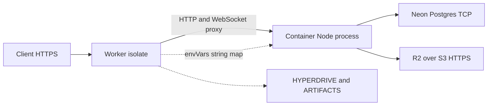

# Hyperdrive and R2 bindings stop at the Cloudflare Container door

RenderMac's API hostname is a Cloudflare Worker. The product that hostname serves is a Node/Fastify control plane. Those are not the same runtime. `@cloudflare/containers` puts the Node process in a sandboxed Linux Container and lets the Worker proxy HTTP and WebSocket into it. Two Cloudflare products that look like they should follow the request across that hop — Hyperdrive and R2 bucket bindings — stop at the Worker isolate. As of 2026-07 they are not usable from inside the Container. This article is the architecture of that door, recorded in ADR 0007 (`docs/adr/0007-hyperdrive-and-r2-media-plane.md`) after we reproduced the failure against upstream reports rather than wiring a connection string that deploys cleanly and dies on DNS.

The public surface is [api.rendermac.com](https://api.rendermac.com). The supporting repository is private, so the excerpts below are the evidence.

## Two runtimes behind one hostname

`deploy/control-plane/src/index.ts` is the front door. It terminates TLS, addresses the Container through a Durable Object binding, and forwards every request — including WebSocket upgrades — into one sticky `primary` instance so agent sessions and the matcher share process memory. The Node process is the image from `deploy/control-plane/Dockerfile`, which runs Fastify via `tsx packages/control-plane/src/server.ts`. Product media compute does not run there. Named FFmpeg and Remotion runners execute on Mac hosts. The Container is the lease, ledger, and artifact-grant coordinator.

The default export never keeps work in the isolate. It always constructs a container URL and calls `container.fetch`:

```ts
export default {
  async fetch(request: Request, env: Env): Promise<Response> {
    const url = new URL(request.url);
    const container = getContainer(env.RENDERMAC_CONTROL_PLANE, "primary");
    return container.fetch(
      new Request(`http://container${url.pathname}${url.search}`, request),
    );
  },
```

`Env` does declare `HYPERDRIVE: Hyperdrive`. Nothing in `fetch` or `scheduled` reads it. The scheduled handler wakes the same primary Container. As of 2026-07 there is no isolate-side cheap read that answers from Hyperdrive without starting Node.

## The Container bridge is a string map plus HTTP

ADR 0007 names the only two channels `@cloudflare/containers` gives us. The first is `this.envVars`, a plain string-to-string map baked into the Container process environment at start. The second is HTTP/WebSocket proxying of request and response bodies. Isolate objects, sockets, and Workers-internal DNS names are not on that list.

The constructor copies Worker secrets into that map. The Dockerfile is not allowed to bake database credentials. Production sets `RENDERMAC_ARTIFACT_BACKEND` to `s3` and forwards the S3 endpoint, key pair, and `RENDERMAC_DATABASE_URL`. It does not copy `env.HYPERDRIVE.connectionString`. The field is typed for a future isolate read; the source comment says forwarding it would deploy cleanly and then fail every request on `*.hyperdrive.local` DNS.

`enableInternet = true` follows from the same door: Postgres and object storage are outbound TCP and HTTPS from the Container's Linux network namespace.



The left dashed edge is the only configuration bridge. The right dashed edge is where Hyperdrive and the R2 bucket binding remain. They are real Worker resources. They are not inputs to Node.

## Hyperdrive resolves to hyperdrive.local

Hyperdrive's `connectionString` is valid inside a Workers-runtime request context. The hostname it yields is `*.hyperdrive.local`. That name is Cloudflare-edge internal. It is not a public address, and it is not a name the Container's resolver can answer.

This is not a RenderMac guess. [cloudflare/containers#97](https://github.com/cloudflare/containers/issues/97) reports assigning `env.HYPERDRIVE.connectionString` into Container `envVars` and a process that cannot connect. [cloudflare/workers-sdk#10831](https://github.com/cloudflare/workers-sdk/discussions/10831) reproduces `could not translate host name` against `*.hyperdrive.local`. On 18 Aug 2025 a Cloudflare maintainer replied that connecting from a container to Hyperdrive is not supported yet, with no ETA, and that it is on the roadmap. Comments in January and February 2026 still asked for an ETA. ADR 0007 (2026-07-22) records that we reproduced that DNS failure, and that as of 2026-07 Hyperdrive-in-Containers remained unsupported.

`deploy/control-plane/wrangler.jsonc` therefore declares a `hyperdrive` block and immediately warns against using it from Node:

```
  // WARNING — do not forward env.HYPERDRIVE.connectionString into the
  // Container's envVars: Hyperdrive connection strings resolve to an
  // internal "*.hyperdrive.local" hostname that is only reachable from
  // Workers-isolate JS, not from a Container's own Linux process. Cloudflare
  // confirmed Hyperdrive-in-Containers is unsupported with no ETA
  // (cloudflare/containers#97, cloudflare/workers-sdk#10831)
```

The trap is cosmetic correctness. A `hyperdrive` array in Wrangler passes `wrangler deploy`. Copying `connectionString` into `envVars` looks like the documented Workers pattern. The first Container query then fails DNS, on the request path, after the deploy already succeeded. ADR 0007 exists so a later change does not re-derive that by shipping it.

Postgres from the Container is a direct Neon connection string in `RENDERMAC_DATABASE_URL`. `packages/control-plane/src/db/pool.ts` builds a `pg.Pool` from `config.databaseUrl`. There is no Hyperdrive client in Node. A Hyperdrive config is still provisioned and bound so a later isolate-only read would not need a second provisioning step. That path is not implemented. A `hyperdrive` block in Wrangler does not mean the job path is pooled through Hyperdrive.

## R2 bindings are isolate objects

The same door stops R2. `wrangler.jsonc` declares an `r2_buckets` binding named `ARTIFACTS`. An `R2Bucket` is a Workers-runtime JavaScript object. It can be used from Durable Object code that still runs in the isolate. It cannot be serialized into `envVars`. There is no `env.ARTIFACTS` read in the Worker entry, and no Container code that expects one.

The path that works from Node is R2's S3-compatible HTTPS API. Production requires it: `packages/control-plane/src/config.ts` will not boot unless `RENDERMAC_ARTIFACT_BACKEND` is `s3` and the endpoint, bucket, and access-key pair are present. `packages/control-plane/src/services/artifacts.ts` constructs an AWS SDK client against that endpoint:

```ts
    s3Client = new S3Client({
      endpoint: config.artifactS3Endpoint,
      region: config.artifactS3Region,
      forcePathStyle: config.artifactS3ForcePathStyle,
      credentials: {
        accessKeyId: config.artifactS3AccessKeyId,
        secretAccessKey: config.artifactS3SecretAccessKey,
      },
    });
```

ADR 0007 states that this is the only R2 path that works from inside a Container today, and that the `ARTIFACTS` binding is for a possible future Worker-side use and is unread. We do not proxy media bytes through the control plane. Single-object put/get uses `getSignedUrl` on `PutObjectCommand` / `GetObjectCommand`. Multipart uploads in `packages/control-plane/src/services/multipartArtifacts.ts` presign `UploadPartCommand` the same way. The Container signs; provider hosts PUT parts to those HTTPS URLs. A production single-object put/head/get/delete canary against that S3 API has passed. Managed-object lifecycle remains a separate proof.

## Image promotion is not process replacement

The same split runtime produces a second production trap. The Worker is a new isolate on deploy. The Container is a long-lived Linux process with `sleepAfter = "30m"` and a sticky `primary` id. Promoting a Container image can leave that already-running primary serving old code until it cycles. The 2026-07-28 public shared-beta canary recorded that image promotion alone did not immediately replace the warm primary. Subsequent API routing changes are accepted only by live behavior on public product paths, not by the deploy version string. Wrangler can report a current image while the process that still holds WebSocket sessions is not.

## Limits

This article does not claim Hyperdrive or R2 are unused on Workers in general, only that as of 2026-07 those bindings do not cross into a Cloudflare Container. It does not claim an ETA, that the constraint has lifted, or that we re-tested the DNS failure on every Wrangler release. If Hyperdrive-in-Containers ships, ADR 0007 says to re-verify against then-current docs. It does not claim the provisioned Hyperdrive config is on the job path, that isolate-side Hyperdrive reads exist, or that the `ARTIFACTS` binding is consumed. It does not claim S3 HTTPS matches a native R2 binding for auth or locality, or that managed R2 lifecycle is proven. It does not claim image promotion always leaves a stale primary — only that it did on 2026-07-28, so acceptance cannot be the version id. No account identifiers, tokens, or connection strings are included. No earnings or pricing argument is offered. The control plane uses Neon TCP and S3 HTTPS because those are values a Container can actually hold.