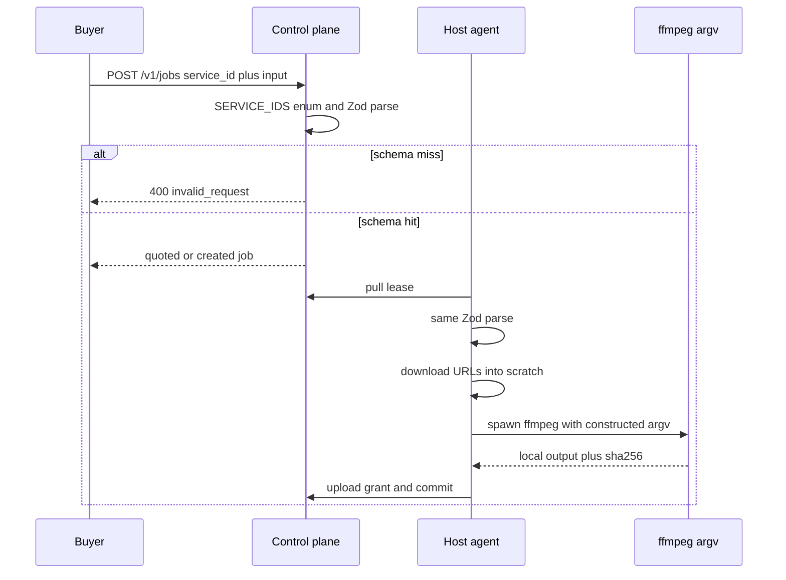

# Named-service media execution as the sandbox

The usual hosted media API is a thin wrapper around someone else's command line: pass flags, a filter graph, a container image, or a script, and hope the sandbox holds. RenderMac is a media compute API for Apple Silicon that refuses that contract. Buyers pick a versioned service and send data. Hosts execute a digest-pinned named runner that builds an argument vector from a shared schema. The finding is architectural, not marketing: a useful stitch, transcode, caption, and mix API does not need arbitrary FFmpeg.

The product surfaces are public ([rendermac.com](https://rendermac.com), [docs.rendermac.com](https://docs.rendermac.com), [api.rendermac.com](https://api.rendermac.com)). The supporting repository is private, so the excerpts below are the evidence.

## Why not “FFmpeg-as-a-service”

FFmpeg's CLI is an exploit and an exhaustion surface as much as it is a codec toolkit. Filter expressions can name files. Protocol handlers can reach the local network. `-i` accepts more than HTTP. A string-concatenated `ffmpeg … ${buyer}` command line is a shell even when the author intended a media job.

The other fashionable answer is to put that command line in a container or a macOS guest. That is the right shape for *hostile code*. It is the wrong default for RenderMac's actual buyers: authenticated SaaS products that already intend the output for public distribution. ADR 0011 (accepted 2026-07-25) classifies the launch data as **public-intent, non-sensitive media**. That classification is a scope and assurance decision. It is not permission to log, retain, inspect, or reuse customer bytes. It also is not a claim that malformed containers, codecs, subtitles, or fonts are trusted. Parser input can still crash or exploit a decoder. The response is a smaller execution language, not a promise that every frame is benign.

Native execution is the product, not a temporary shortcut. VideoToolbox and the Media Engine are the reason the work runs on a Mac. Virtualization.framework guests do not offer a documented first-class Media Engine passthrough. Making a VM mandatory would add memory, disk, and startup cost while weakening the differentiator, without matching the confidentiality requirement of the launch catalog. ADR 0012 later describes an optional host Isolation mode and a future confidential-compute tier. Those are not the launch sandbox, and they are not claimed as shipping here.

## The catalog is the API

The wire protocol enumerates services. There is no open-ended “run ffmpeg” identifier.

```ts
export const SERVICE_IDS = [
  "ffmpeg.stitch_export.v1",
  "ffmpeg.caption_burn.v1",
  "ffmpeg.transcode.v1",
  "ffmpeg.audio_mix.v1",
  "remotion.inspect.v1",
  "remotion.render.v1",
  "ffmpeg.assemble.v1",
] as const;
```

`CreateJobRequestSchema` takes `service_id: z.enum(SERVICE_IDS)` and an `input` object. Quote and create both run the same per-service parser in the control plane (`packages/control-plane/src/services/jobs.ts`):

```ts
function validateInput(serviceId: string, input: Record<string, unknown>) {
  if (serviceId === "ffmpeg.stitch_export.v1") {
    return FfmpegStitchExportInputSchema.parse(input);
  }
  if (serviceId === "ffmpeg.transcode.v1")
    return FfmpegTranscodeInputSchema.parse(input);
  // …caption_burn, audio_mix, remotion.*, assemble
  throw Object.assign(new Error(`service ${serviceId} is not available`),
    { code: "invalid_input" });
}
```

A stitch job is ordered clip URLs in, one MP4 out. Codecs are a closed enum, not a string the buyer invented:

```ts
export const FfmpegStitchExportInputSchema = z.object({
  input_urls: z.array(z.string().url()).min(1).max(64),
  output_container: z.literal("mp4").default("mp4"),
  video_codec: z.enum(["copy", "h264_videotoolbox", "libx264"]).default("copy"),
  audio_codec: z.enum(["copy", "aac"]).default("copy"),
});
```

Transcode allows an optional integer `height` capped at 2160, then the runner interpolates `scale=-2:${input.height}` from that number. Caption burn takes `captions_format: z.enum(["ass", "srt"])`. Audio mix is the most “programmable” FFmpeg family member, and it is still declarative:

```ts
export const FfmpegAudioMixTrackSchema = z.object({
  input_url: z.string().url(),
  role: z.enum(["dialogue", "music", "effect"]),
  start_ms: z.number().int().min(0).max(86_400_000).default(0),
  gain_db: z.number().min(-60).max(12).default(0),
  loop: z.boolean().default(false),
}).strict();
```

`.strict()` is the injection test. A track that includes `filter_complex: "amovie=/etc/passwd"` fails Zod in `packages/shared/src/protocol.test.ts` and returns HTTP 400 `invalid_request` from `POST /v1/jobs` in the control-plane integration suite. Seventeen tracks fail the `max(16)` bound. An empty stitch `input_urls` array fails `min(1)` the same way.

| Rejected input class | What the schema does | Allowed field instead |
| --- | --- | --- |
| Shell command, extra FFmpeg flags, unknown JSON keys | `.strict()` / enum parse fails | Versioned `service_id` plus the fields below |
| `filter_complex`, `amovie`, buyer filter expressions | Unknown key on a strict track object | `role`, `start_ms`, `gain_db`, `loop` |
| Unbounded mix | `tracks` max 16 | 1–16 tracks |
| Empty or huge stitch lists | `input_urls` min 1, max 64 | Ordered URL list (docs ask for public HTTPS) |
| Arbitrary encoder name (`libx265` on stitch) | Codec enum | `copy`, `h264_videotoolbox`, `libx264` |
| Remotion path traversal (`../`, absolute `/etc/passwd`) | `superRefine` on the relative entry | Host-set project root, or digest-pinned `serve_url` |
| Buyer executable, container, plugin, package install | Not in `SERVICE_IDS` | Data URLs and schema parameters |

## Runners build argv; they do not interpolate a shell

The host agent re-parses the same schema on the lease, downloads each URL into an attempt-scoped scratch directory, and passes **local paths** to FFmpeg. `runFfmpegStitchExport` is typical (`packages/agent/src/runners/ffmpegStitchExport.ts`):

```ts
const vcodec = input.video_codec === "copy" ? "copy" : input.video_codec;
const acodec = input.audio_codec === "copy" ? "copy" : input.audio_codec;
await runFfmpeg([
  "-y", "-f", "concat", "-safe", "0", "-i", listPath,
  "-c:v", vcodec, "-c:a", acodec, outputPath,
], opts.signal);
```

`video_codec` is already an enum member, so it is safe to place in the argv. The concat list file is written by the runner from agent-controlled scratch paths, not from buyer path strings. Audio mix is the same idea with a larger graph: `mixGraph` emits `adelay`, `volume`, `amix`, and `sidechaincompress` from numeric `start_ms` / `gain_db` / ducking fields. Buyers never supply the filter string.

Every FFmpeg family runner goes through `runManagedChildProcess`, which `spawn`s the binary with an argument array (`packages/agent/src/runners/common.ts`). There is no `exec`, no `/bin/sh -c`, and stdin is ignored. `runFfmpeg` then injects a host-side `-threads` budget; that knob is presence policy, not a buyer flag.

The control-plane never proxies media bytes. The agent fetches inputs, FFmpeg sees files, the runner hashes the output, and a later upload uses an attempt-scoped artifact grant. Local Tier-A qualification on 2026-07-22 ran stitch, transcode (VideoToolbox), caption burn, and audio mix through quote, lease, runner, upload, and verification on Apple Silicon FFmpeg. A 2026-07-26 public-path canary completed `ffmpeg.stitch_export.v1` through `https://api.rendermac.com` rather than a localhost shortcut.



## Remotion is a pinned bundle, not buyer code

`remotion.render.v1` and `remotion.inspect.v1` exist because some jobs are compositions, not concat. They still are not “run my Node project.” Remote inspection requires a content-addressed bundle manifest (`bundle_manifest_url` together with a 64-hex `bundle_manifest_sha256`). A local entry point must be relative to an operator-controlled `RENDERMAC_REMOTION_PROJECT_ROOT`; leading slashes and `..` segments fail. `buildRemotionRenderArgs` emits a fixed `npx remotion render` vector (`--codec`, `--image-format`, `--pixel-format`, optional `--frames`) from schema enums. Buyer `input_props` are JSON data. Remote media is downloaded to scratch and spliced into those props as local paths. `ffmpeg.assemble.v1` is a separate reduce service for ordered shard URLs, defaulting to stream-copy, so the stitch contract does not have to absorb internal sharding.

That is the honest size of the code-bearing path: platform-reviewed, digest-pinned executable graph, plus data. It is not a plugin marketplace.

## What this is not

ADR 0011 also asks for a dedicated low-privilege runner identity with no access to the provider home directory, Keychain, device credential, updater keys, control-plane secrets, or sibling job directories, and for FFmpeg itself to have no network. The second half of that sentence is true of the child argv: runners hand FFmpeg local scratch paths. The first half is **not** the production process model. `cli.ts` still dispatches `runFfmpegStitchExport` and the other runners inside the agent process. The agent still performs the download. A separate networkless user is planned containment, not a shipping sandbox. The VM supervisor in the tree is a fail-closed stub and is not wired into lease handling.

Resource policy that *does* ship includes a per-transfer byte ceiling on downloads (default 1 GiB) and attempt-scoped scratch with a cleanup receipt that records `logical_delete: true` and `physical_erasure_claimed: false`. FileVault and SSD wear-leveling remain host controls. Those receipts are honesty about deletion, not a claim of cryptographic erasure.

## Limits

This article does not claim that named services stop a malicious media file from crashing or exploiting a decoder. It claims the buyer cannot choose the decoder command. It does not claim the production runner is already a distinct low-privilege networkless user, that Virtualization.framework isolation is live, that confidential compute is available, or that operators inspect customer media. It does not claim the agent's `fetch` downloader is a complete SSRF product: the schema requires a URL, product docs ask for public HTTPS, and FFmpeg is kept off the network by local paths. It does not claim every catalog service has equal production evidence; the public-path canary cited above is stitch. Remotion still executes JavaScript from a pinned bundle, which is trusted code under operator control, not an open plugin ABI. No earnings, pricing, or marketplace-supply argument is offered. The result is a smaller media API that is still wide enough to concatenate, transcode, burn captions, mix a bounded timeline, and render a digest-pinned composition.