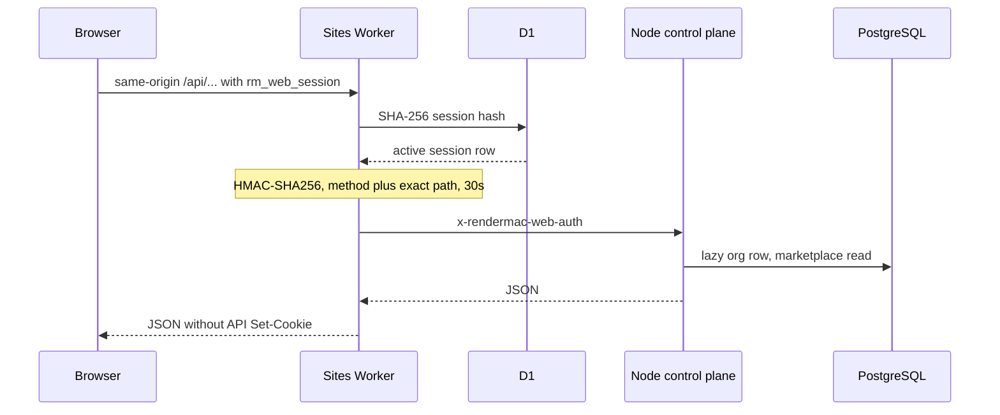

## Two stores and four unmixed credentials

A browser console and a machine API should not share a credential. Cookies belong on first-party pages. API keys belong in SDKs. Host enrollment is a one-use pairing step. A paired Mac holds a device token. If those four are interchangeable, a stolen cookie becomes a fleet credential.

RenderMac stores them in different systems and refuses substitution. Cloudflare D1 owns website users, password state, verification and reset tokens, and browser sessions. PostgreSQL owns marketplace, job, device, and ledger state. There is no third browser identity store. The consoles `https://app.rendermac.com` and `https://provider.rendermac.com` terminate at the `rendermac-sites` Worker. The Node API at `https://api.rendermac.com` never sees the website cookie.

`docs/WEB-IDENTITY-HOST-AUTH-AND-DISTRIBUTION.md` names the four credentials:

1. Website session. Cookie `rm_web_session` is HttpOnly, Secure, SameSite=Lax, and host-only. The `Set-Cookie` line in `sessionCookie` has Path, Max-Age, HttpOnly, Secure, and SameSite=Lax, and no Domain attribute. D1 stores SHA-256 of the token as `token_hash`. The plaintext is prefixed `rm_web_` and lives only in the cookie jar.
2. Organization API key. Bearer tokens with `rm_live_` or `rm_test_` prefixes, hash-only in PostgreSQL. The sites Worker never writes one into browser storage.
3. Enrollment code. One-use, time-limited `rm_pair_…`.
4. Device token. `rm_device_…`. Plaintext only on the Mac that claimed the code.

A cookie cannot claim a device. An API key cannot mint a website session. An enrollment code cannot be reused as a WebSocket bearer. That rule is the identity boundary. The rest of this article is how a first-party page still reaches the control plane.

## The sites Worker is the only browser bridge

`handleIdentityRequest` in `deploy/sites-worker/src/identity.ts` returns null unless `host` is in `PRIVATE_WEB_HOSTS`. Only `app.rendermac.com` and `provider.rendermac.com` run this code. Signup, login, logout, and password request/reset call `assertSameOrigin` before they touch D1: the `Origin` header must equal `new URL(request.url).origin`. A missing or mismatched origin is HTTP 403 `invalid_origin`.

`GET /auth/session` resolves the cookie against D1. Any path under `/api/` requires an active session, then `proxyControlPlane`. Mutating `/api/*` methods (everything except GET and HEAD) repeat the same-origin check. The Worker does not forward `Cookie`. It does not attach an organization API key. It copies an allowlist and sets one header of its own:

```ts
const FORWARD_REQUEST_HEADERS = new Set([
  "accept",
  "accept-language",
  "content-type",
  "content-length",
  "idempotency-key",
  "if-none-match",
  "range",
  "user-agent",
]);
```

`Cookie`, `Authorization`, and a caller-supplied `x-rendermac-web-auth` are not on that list. The Worker then `headers.set("x-rendermac-web-auth", …)` itself. The upstream `fetch` uses `redirect: "manual"` and `AbortSignal.timeout(30_000)`. Response `Set-Cookie` is stripped so the container cannot write a second browser session.



## HMAC bound to method and exact path

`ASSERTION_TTL_SECONDS` is 30. After D1 says the session is active, `assertionFor` builds a version-1 payload that includes the website user, organization, role, and the request being proxied. The signed fields that matter for reuse are `method`, `path`, `iat`, `exp`, and `jti`:

```ts
const payload = {
  v: 1,
  sub: session.user_id,
  org_id: session.organization_id,
  org_name: session.organization_name,
  email: session.email,
  display_name: session.display_name,
  role: session.role,
  beta_participation: session.beta_participation,
  beta_terms_version: session.beta_terms_version,
  method: request.method.toUpperCase(),
  path: upstreamPath,
  iat: now,
  exp: now + ASSERTION_TTL_SECONDS,
  jti: crypto.randomUUID(),
};
const encoded = base64url(encoder.encode(JSON.stringify(payload)));
return `${encoded}.${await hmac(secret, encoded)}`;
```

`hmac` is Web Crypto HMAC-SHA256. The wire format is two parts, encoded payload and signature, not a three-part JWT. `path` is `pathname + search` of the upstream URL, including the query string. A GET of `/v1/me` cannot be presented as POST `/v1/jobs`. A captured header is stale after 30 seconds.

The Node container verifies that contract in `packages/control-plane/src/services/webAuthAssertion.ts`. `requireBuyerAuth` reads `x-rendermac-web-auth` first. On success it sets `identitySource: "cloudflare_d1"` and lazily inserts the D1-chosen organization UUID into PostgreSQL (`ON CONFLICT DO UPDATE`). The D1 cookie never arrives. The verifier uses Node `createHmac` and `timingSafeEqual`, then rejects `payload.method !== method`, `payload.path !== options.path`, and `payload.exp <= now`. It also rejects `exp` more than 60 seconds in the future, so a mis-minted long TTL would not pass.

A unit test in `webAuthAssertion.test.ts` accepts a POST bound to `/v1/provider/enrollment-codes?source=web` at `now + 1`, and rejects a suffix on the header, GET instead of POST, path `/v1/jobs`, and `now + 31`. `jti` is required to be a UUID. This article does not claim a server-side nonce table; freshness is the 30-second `exp` plus the method/path bind.

## Pathname assignment keeps the assertion on-origin

The assertion is only as safe as the URL it is fetched against. The trap is relative URL resolution. Passing a request-controlled path into `new URL(userPath, origin)` treats a string that begins with `//` as a scheme-relative URL, so the resulting object's host is no longer the configured API origin. RenderMac does not construct the upstream that way.

`controlPlaneTarget` parses the configured origin first (default `https://api.rendermac.com`). It rejects non-HTTPS except loopback HTTP, userinfo, a pre-set search or hash, and any origin pathname other than `/`. Only then does it assign:

```ts
upstream.pathname = incoming.pathname.slice("/api".length) || "/";
upstream.search = incoming.search;
upstream.searchParams.delete("__preview_host");
const upstreamPath = `${upstream.pathname}${upstream.search}`;
```

Assigning `pathname` cannot change origin. Wrangler's local `__preview_host` query is deleted so it never becomes part of the signed path.

The unit test in `deploy/sites-worker/src/identity.test.ts` is the evidence for that defense. It feeds a double-slash path under `/api/` and asserts the origin stays on the configured API host:

```ts
const { upstream, upstreamPath } = controlPlaneTarget(
  "https://api.rendermac.com",
  new URL("https://app.rendermac.com/api//attacker.example/stolen?x=1"),
);
assert.equal(upstream.origin, "https://api.rendermac.com");
assert.equal(
  upstream.href,
  "https://api.rendermac.com//attacker.example/stolen?x=1",
);
assert.equal(upstreamPath, "//attacker.example/stolen?x=1");
```

The double-slash remains a path on `api.rendermac.com`. It does not become a different host. A second test rejects `http://api.rendermac.com` as a configured origin and rejects an origin with an unexpected path prefix. The comment on `controlPlaneTarget` states the intent: keep the short-lived website assertion from being forwarded off-platform.

Because `path` in the HMAC payload is that `upstreamPath`, even a contained double-slash path is bound into the signature. The Node verifier will accept it only for that exact path.

## Limits

This is a case study of a shipping Worker-plus-container identity split, not a proof. We do not claim that `jti` is stored and checked for replay; it is UUID-shaped and unused as a nonce ledger in the verifier we read. SameSite=Lax plus Origin checks are the CSRF controls in this file, not a complete CSRF theory. There is no cross-database transaction: D1 commits the website user first, and PostgreSQL materializes the org on first API use. That split is intentional and eventual.

We also do not claim that every URL implementation matches WHATWG host replacement. The implemented defense is "do not resolve a request-controlled path as a relative URL," written as origin copy plus pathname assignment, with one unit test. Mac Keychain pairing, loopback Host/Origin checks, and device WebSocket auth are a separate credential surface and are not re-derived here. The supporting repository is private; excerpts above are from `identity.ts`, `identity.test.ts`, `webAuthAssertion.ts`, and `WEB-IDENTITY-HOST-AUTH-AND-DISTRIBUTION.md` at commit `56a728eb1837a5760b2a6f81d8e14714726deb32`.